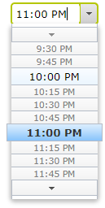
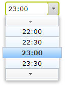
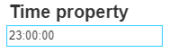

>> This is about .NET CORE 5 version. If you are interested about .NET FRAMEWORK 4 please visit https://github.com/advanced-cms/time-property/blob/net4_master/README.md

[](https://github.com/advanced-cms/time-property/actions/workflows/time-property-dotnet-core.yml)

# time-property
Episerver property used to store time between 0-24 hours

Property is stored in the model as a [Timespan](https://docs.microsoft.com/en-us/dotnet/api/system.timespan) type.
It's using [dijit/form/TimeTextBox](https://dojotoolkit.org/reference-guide/1.10/dijit/form/TimeTextBox.html) as an editor in Edit Mode.



## Getting Started
First install `Advanced.CMS.TimeProperty` package from EPiServer's NuGet [feed](https://nuget.episerver.com/).
```
PM> Install-Package Advanced.CMS.TimeProperty
```
Then add new TimeSpan property to your content model. The property needs to be annotated with `BackingType` attribute.

```csharp
[ContentType(GUID = "AREDS8A41-5C8C-G3PJ-8F74-320ZF3DE8227")]
public class TestPage : PageData
{
    [BackingType(typeof(Advanced.CMS.TimeProperty.TimeProperty))]
    public virtual TimeSpan? Time1 { get; set; }
}
```

### Edit mode configuration

By default the editor will be displayed using 12-hour clock time format. 
To change this you can use `TimePropertySettings` attribute added on the model.
For example, to get 24-hour clock format:

```csharp
[ContentType(GUID = "AREDS8A41-5C8C-G3PJ-8F74-320ZF3DE8227")]
public class TestPage : PageData
{
    [BackingType(typeof(Advanced.CMS.TimeProperty.TimeProperty))]
    [TimePropertySettings(TimePattern = "HH:mm")]
    public virtual TimeSpan? Time1 { get; set; }
}
```

Then it will be rendered as:



### View mode property renderer

Nuget contains renderer for the view mode. You need to use `PropertyFor` and `TimeSpan` tag:

```asp
@Html.PropertyFor(x => x.CurrentPage.Time1, new { Tag = "TimeSpan" })
```



To render time with custom format use `DateFormat` property:

```asp
@Html.PropertyFor(x => x.CurrentPage.Time1, new { DateFormat = "hh:mm tt", Tag = "TimeSpan" })
```


